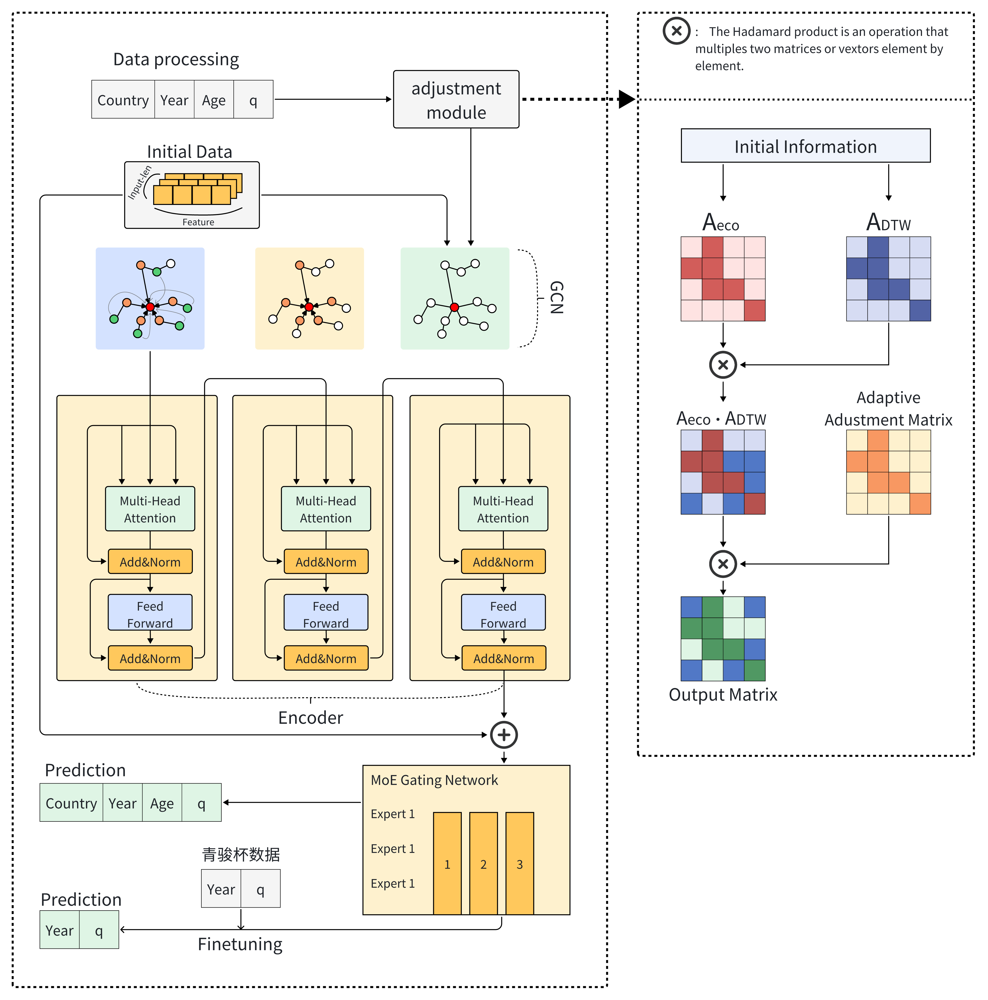

# Mortfusion
A mortality prediction model under an integrated framework that comprehensively incorporates global population trend dynamics.
# 🌐 Mortality Forecasting with GCN-Transformer

本项目构建了一个 **多国死亡率预测系统**，基于 **GCN 图神经网络** 提取各国结构特征，结合 **Transformer（Encoder-only 或 Seq2Seq）** 和**MoE** 架构完成时间序列预测，支持对中国行业死亡率表进行微调预测。

---

## 项目结构

```
.
├── main.py                          # 主入口：训练+递推预测
├── funetuning.py                   # 行业表微调脚本（如中国保险死亡率表）
├── config.py                       # 全局配置参数
│
├── models/
│   ├── mortality_gcn.py           # 图卷积模型和国家特征加载方法
│   ├── transformer_encoderonly.py # Transformer Encoder-only 模型
│   └── transformer_seq2seq.py     # Transformer Seq2Seq 模型
│
├── utils/
│   ├── data_loader.py             # 数据读取与标准化工具
│   ├── data_preparation.py       # 多国模型输入构造
│   ├── prepare_industry_inputs.py# 行业微调输入构造
│   ├── predictor.py               # 递推预测与导出
│   └── position_encoding.py       # 正余弦位置编码生成
│
├── DTW.py                          # 基于 DTW 的国家距离矩阵生成
├── model_runner.py                 # 模型构建、训练与评估
└── outputs/                        # 模型权重与预测结果输出目录
```

---

## 模型架构

- **图卷积网络 (GCN)**  
  利用 DTW 距离生成的国家相似性邻接矩阵，编码国家之间的结构关系，提取静态向量表示 `h_country`。

- **Transformer 模型**
  - **Encoder-only** 架构：适用于自回归预测，逐年递推未来死亡率；
  - **Seq2Seq** 架构：支持并行预测多个未来年份；
  - 输入包含：
    - 历史死亡率（标准化 + log）
    - GCN 结构特征
    - 正余弦位置编码

- **青骏杯数据 finetuning**
  利用青骏杯提供的行业数据，微调预训练得到的基座大模型。
  



---

##  快速开始

### 1. 配置路径（`config.py`）

```python
PCA_FOLDER = "your_pca_folder/"
DATA_DIR = "your_hmd_dataset/"
OUTPUT_DIR = "outputs/"
MEAN_CSV = "stats/{}_mean.csv"
STD_CSV = "stats/{}_std.csv"
DTW_MATRIX_PATH = "dtw_distance_matrix.csv"
```

### 2. 运行全局训练与预测

```bash
python main.py
```

### 3. 微调到中国行业死亡率表（需替换路径）

```bash
python funetuning.py
```

---

## 输出结果

- `outputs/base_model.pth`：预训练模型参数（多国数据）
- `outputs/industry_finetuned.pth`：行业微调后的模型
- `outputs/*.csv`：每个国家或行业的预测死亡率表（含历史 + 未来）

---

##  依赖环境

- Python 3.8+
- PyTorch >= 1.12
- pandas / numpy / matplotlib / tqdm
- dtaidistance

安装依赖（建议使用虚拟环境）：

```bash
pip install -r requirements.txt
```

---

##  引用格式建议

如果你在研究中使用此代码，请引用类似：

> This mortality forecasting framework integrates dynamic GCN-encoded structure features with Transformer-based temporal modeling, supporting multi-country training and country-specific fine-tuning.
